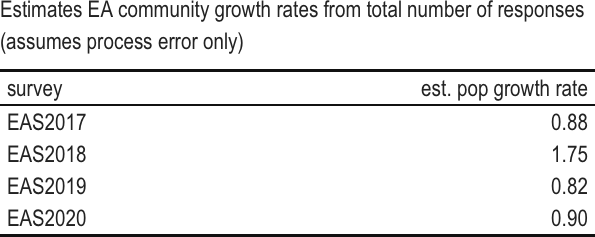

```{r setup}
knitr::opts_chunk$set(echo = TRUE)
library(rmarkdown)
library(kableExtra)
#install.packages("webshot")
#webshot::install_phantomjs(force=TRUE)
library(magick)
library(webshot)
```

### Survey data

We're using the self-report of "year joined EA" and total response rate in 5 years worth of surveys to determine if we can detect changes in the population of EAs

```{r surveyraw}
##read in and flip if .csv
#survey=t(as.data.frame(read.csv("EAsurveyjoin.csv", row.names=1)))
#fix row names
#row.names(survey)=sub("X", "",row.names(survey))
#got some empty rows here
#ndat <- apply(survey, 1, function(x) all(is.na(x)))
#survey <- (survey[ !ndat, ])

#read in and flip if .xlsx
library(openxlsx)
survey=t(as.data.frame(read.xlsx("EAsurveyjoin.xlsx", rowNames=TRUE)))
psurv=as.data.frame(survey)

#create column of year joined and rearrange
psurv$joined=as.numeric(row.names(survey))
psurv=psurv[,c(6, 1:5)]

#create table of values, save as image and include that image in doc
#basic table
xtab=kable(psurv, row.names=FALSE, format="html", table.attr = "style='width:40%;'",
   caption="Number of EA survey respondants with self-reported year of joining the EA community")

#apply some formatting
xtab3=kable_classic(xtab)

#save high quality image (zoom) with white background ("flatly")
save_kable(xtab3, file="surveydata.png", density=600, zoom = 1.5, bs_theme = "flatly")

#put image in doc
knitr::include_graphics("surveydata.png")
```

*Getting a table with reasonable resolution in the document is a bit convoluted. We need to zoom-in to take a higher resolution capture. But then we end up with zoomed in font sizes. Setting the output width did not seem to help with customization, nor did setting the dpi in include_graphics. Needs more fiddling. Also to note, if the table is an image, the text will not be available for accessibility readers, so we will need to include alt text as for figures.* 


### Count-based estimates of EA community growth

#### Observation error only

The first and simplest option is just to use the total number of responses from each survey as an index of current EA population size, and obtain growth rates from any change from year to year. Our assumptions are that a single survey samples all year classes evenly, each survey samples the population proportionately at the same rate, and there is density-independent growth of the community. These assumptions could be modified by attaching probabilities for response rates to either year classes or individual surveys or both. 

If we assume that year to year variation in survey response is only due to observation error, then the population growth rate can be estimated from the slope of a linear regression of ln population size vs time (since $ln{N_t}=ln{N_0}+r(T)$ for exponential growth). This is a common and inutitve method of estimating population growth rates (Caughley 1977); however, if even a small amount of the variance (>10%) actually arises from process error, the confidence intervals will strongly underestimate the actual uncertainty ([Humbert et al. 2009](https://doi.org/10.1111/j.1600-0706.2009.17839.x))

*NB: some minor weirdness getting equation to render in html preview, cannot have two letters without an operator between them?*

```{r, fig.cap="Regression to estimate population growth rates (assumes observation error dominates)"}
# create dataframe with total number of respondents per survey year
popsize=colSums(survey, na.rm=TRUE)
popyear=as.numeric(substring(names(popsize), 4, 7))
pop=data.frame(size=popsize, year=popyear)

#regress ln respondents vs year
popreg=lm(log(size)~year, data=pop)

#table of output
regout=c(summary(popreg)$coefficients[2,], summary(popreg)$adj.r.squared)
names(regout)[5]="adj.r.squared"
regco=kable(t(regout), format="html", table.attr = "style='width:60%;'",
   caption="Linear regression for natural log of EA survey respondants vs self-reported year of joining the EA community")
save_kable(kable_classic(regco),file="regcoef.png", density=600, zoom = 1.5, bs_theme = "flatly")

newx = seq(min(pop$year),max(pop$year),by = 0.05)
conf_interval <- predict(popreg, newdata=data.frame(year=newx), interval="confidence", level = 0.95)

plot((popsize)~year,data=pop, log="y", pch=16, ylab="ln(survey respondents)", xlab="year", ylim=c(1000, 3000), cex.lab=1.5)

# Backtransform to get confidence intervals
conf_t <- exp(conf_interval)
lines(newx, conf_t[,1], col="red", lwd=2)
lines(newx, conf_t[,2], col="blue", lty=2, lwd=2)
lines(newx, conf_t[,3], col="blue", lty=2, lwd=2)

```

*Note that the figure captions in then chunk headers are not rendering.... there may be a fix referenced [here](https://github.com/rstudio/rmarkdown/issues/1756), but I am not able to figure it out quickly.*

```{r regtable}
#put table image in doc
knitr::include_graphics("regcoef.png")
```

While the predicted annual population growth rate is given by $e^{\beta_1}$ of the regression (`r round(exp(popreg$coeff[2]),2)`), we can see that there is too much variation for the amount of data here, and that the regression coefficients are not significantly different from zero. So either the EA community is not growing, or we cannot detect growth with this data. It may be that if we had any info regarding survey response rates, this variation might be reduced.

#### Process error only
An alternative approach is to assume there is only temporal stochastic variation that causes measures of population size to fluctuate from year to year. That is, any fluctuations are real, not observation error. Here population size in the future is given by previous population size, the average population growth, and an error term (e.g., $ln{N_{t+1}}=ln{N_t}+\mu+\epsilon$ where $\epsilon$ ~ Normal(0,$\sigma^2$). That is we describe the change in population size as diffusion plus drift. The simplest method of estimating the population growth rate is then the geometric mean of the calculated annual population growth rate ($\lambda=N_{t+1}/N_{t}$). 

```{r}
#tiny bit of mucking 'cause we have a 2-year interval
Nf=popsize[2]
NF1=popsize[1]
lam1=sqrt(popsize[2]/popsize[1])

#calculate the rest of the growth rates and save
Nt1 = popsize[-(1:2)]
Nt = popsize[2:(length(popsize) - 1)] 
lamt = Nt1/Nt
lam=as.data.frame(c(lam1,lamt))
kx=data.frame(survey=colnames(psurv)[3:6], pgrow=lam)

#get the geo mean
gmlam = exp(mean(log(lam[,1]), na.rm=TRUE)) 
gslam = exp(var(log(lam[,1]), na.rm=TRUE))

#create table & save as image
tab2=kable(kx, col.names=c("survey", "est. pop growth rate"),row.names=FALSE, format="html", table.attr = "style='width:20%;'",
           digits=2,
   caption="Estimated EA community growth rates assuming only process error")
tab3=kable_classic(tab2)
save_kable(tab3, file="tab3.png", density=600, zoom = 1.5, bs_theme = "flatly")

```


We get an estimated population growth rate of `r round(gmlam, 2)`, but the variance about the estimate is quite large (`r round(gslam, 2)`), and this average population growth rate is strongly influenced that the estimate  from the 2018 survey. 

This method is relatively robust to a small amount of observation error and performs well as long as the ratio of process to observation variance is greater than 5 ([Humbert et al. 2009](https://doi.org/10.1111/j.1600-0706.2009.17839.x)).

Obviously the best approach for this class of methods is to include both observation and process error simultaneously, using a state space approach for example. But these methods will not be at all robust with fewer than 10 years of data.

#### Post-hoc

We could possibly estimate the population growth rate from each survey by just assuming that the previous year's population size (as estimated by a similar survey, with similar response rates) can be indexed as the sum over all other age classes. We have a problem with this *quasi* age-based approach in that it does not incorporate the impacts on population growth regarding retention rates of new recruits. there is a strong assumption of proportional sampling for all age classes.

```{r posthoc}
#reverse order to setup like lifetable
ssurv=survey[order(-as.numeric(row.names(survey))),]

phgrow=vector()

for (i in 1:ncol(ssurv)){
lt=as.data.frame(ssurv[!is.na(ssurv[,i]),i])
phgrow[i]=1+lt[1,1]/sum(lt[-1,1])
}

#get the geo mean
gmph = exp(mean(log(phgrow), na.rm=TRUE)) 
gslph = exp(var(log(phgrow), na.rm=TRUE))

phx=data.frame(survey=colnames(ssurv),grow=phgrow)

#create table & save as image
phtab=kable(phx, col.names=c("survey", "est. pop growth rate"),row.names=FALSE, format="html", table.attr = "style='width:20%;'",
           digits=2,
   caption="Estimates EA community growth rates from quasi-aged-based approach")

save_kable(kable_material_dark(phtab), file="phtab.png", density=600, zoom = 1.5, bs_theme = "flatly")

```

*Somewhat oddly, each table format seems to have its own responses to the snapshot setting*


The average annual population growth rate from this method is then given by the geometric mean, `r round(gmph,2)`, with variance `r round(gslph, 2)`.

### Age-based estimates of EA community growth

We can also use static (or vertical) life table approaches ([Yusuf et al. 2014](https://doi.org/10.1007/978-94-007-6784-3_7)) to estimate attrition rates by age, in order to get population growth rates. In this approach, we need not assume there is similarity in response rates between different surveys. However, this approach does assume that the age distribution is stable from year to year (e.g., for example, it would assume that there was not a big event which increased recruitment in 2018). Therefore, these calculations do rely on the assumption that the actual recruitment, attrition, and survey response rates are the same between years within a given survey report. 

For this method we calculate the community growth rate as $\sum(l_x*m_x)$, where $l_x$ is the retention rate specific to each age class, and $m_x$ is the number of new recruits per current member of the EA community.

```{r attrition, fig.caption="Number of responses by years in the EA community", eval=TRUE,echo=TRUE, fig.width=8}

#reverse order to setup like lifetable
ssurv=survey[order(-as.numeric(row.names(survey))),]

#calculate attrition and pop growth rates for each survey
grow=vector()
decr=vector()
statictab=list()
for (i in 1:ncol(ssurv)){
lt=as.data.frame(ssurv[!is.na(ssurv[,i]),i])

#There is some variation here that leads to survival rates >1
#therefore, if the change in the number of individuals from a younger to older year class
#is positive rather than negative, I will set change to zero 
gain=(lt[-nrow(lt),])
chng=gain[-1]-gain[-length(gain)]
chng=c(chng,NA)
chng=ifelse(chng>0, 0, chng)

#calculate retention rates
yr=as.numeric(row.names(lt))
prop=gain/gain[1]
attr=abs(chng)/gain

#calculate age as EA
date=yr[-length(yr)]
years=date[1]-yr[-length(yr)]

#store
df=data.frame(date=date,years=years,num=gain, lx=prop, loss=chng, qx=attr)

#calculate pop growth rate using attrition
dfnew=df$num[1]
mx=dfnew/(sum(df$num[-1]))
Ro=sum(df$lx*mx)
littler=log(Ro)
grow[i]=littler
decr[i]=mean(df$qx, na.rm=TRUE)
statictab[[i]]=df
}

#get the geo mean
amph = exp(mean((grow), na.rm=TRUE)) 
aslph = exp(var((grow), na.rm=TRUE))


#create table of pop growth rates
agrow=data.frame(survey=colnames(ssurv), growth=exp(grow))
stabfrow=kable(agrow, col.names=c("survey","est. pop growth rate"), caption="EA community growth rates using raw age data and static life table approach", digits=2,row.names=FALSE, format="html", table.attr = "style='width:20%;'")
save_kable(kable_paper(stabfrow), file="stab.png", density=600, zoom = 1.5, bs_theme = "flatly")


```

The average annual population growth rate from this method is then given by the geometric mean, `r round(amph,2)`, with variance `r round(aslph, 2)`. However, these estimated rates include observations which violate the assumption that recruitment and attrition rates do not vary from year to year (e.g., a larger number of EAs with age 4 in the community than the number of EAs with age 2).
```{r}
par(mfrow=c(1,2))
dplo=statictab[[1]]
plot(dplo$years,dplo$num, pch=16, xlab="years as EA", type="b",ylab="# respondants")
legend("topright",colnames(ssurv)[1], pch=16, lty=1, col=1, bty="n" )
dplo=statictab[[1]]
plot(dplo$years,dplo$num, pch=16, xlab="years as EA", type="b",ylab="# respondants",
     xlim=c(0,10), ylim=c(0,800))
for (j in 2:5) {
  dplo=statictab[[j]]
  lines(dplo$years,dplo$num, pch=16,type="b", col=j)
}
legend("topright",colnames(ssurv)[1:5], pch=16, lty=1, col=1:5, bty="n" )
```

For some survey years (for example 2015), this assumption does not look bad. But for other years, it seems much less likely

Looking at the shape of these, I'm inclined to be dubious about response rates of EAs less than 2 years old (maybe they don't respond to the survey in the same numbers etc). So, I'm going to exclude these year classes for now, and see what we get. However, it is perfectly possible that we **do** have dramatically different recruitment rates in different years.

Our model of EA community growth will then assume that we don't have a new EA until after the 2 year mark. In addition, I should note that as above, I've had to exclude the >2009 year class, because it is always larger than 2010 (a consequence of amalgamating all older years). So, this time, $m_x$ is now the number of new 2-year-old EAs per existing older member of the community.


```{r}
grow=vector()
decr=vector()
statictab=list()

#calculate retention rates excluding year classes 1-2
#for each survey
for (i in 1:ncol(ssurv)){

lt=as.data.frame(ssurv[!is.na(ssurv[,i]),i])
lt$yr=as.numeric(row.names(lt))

#remove EAs less than 2
lt=lt[-(1:2),]

#calculate retention
gain=(lt[-nrow(lt),1])
chng=gain[-1]-gain[-length(gain)]
chng=c(chng,NA)
chng=ifelse(chng>0, 0, chng)


prop=gain/gain[1]
attr=abs(chng)/gain
date=lt$yr[-length(lt$yr)]

years=date[1]-lt$yr[-length(lt$yr)]
df=data.frame(date=date,years=years,num=gain, lx=prop, loss=chng, qx=attr)

#calculate growth
dfnew=df$num[1]
mx=dfnew/(sum(df$num[-1]))
Ro=sum(df$lx*mx)
littler=log(Ro)
grow[i]=Ro
decr[i]=mean(df$qx, na.rm=TRUE)
df$surv=lt$surv[1]
statictab[[i]]=df
}

#get the geo mean
a2mph = exp(mean(log(grow), na.rm=TRUE)) 
a2slph = exp(var(log(grow), na.rm=TRUE))

#plot 
dplo=statictab[[1]]
par(mfrow=c(1,2))
plot(dplo$years+2,dplo$num, pch=16, xlab="years as EA", type="b",ylab="ln respondants",log="y",
     xlim=c(0,10), ylim=c(10,1000))
for (j in 2:5) {
  dplo=statictab[[j]]
  lines(dplo$years+2,dplo$num, pch=16,type="b", col=j)
}


plot(dplo$years+2,dplo$lx, pch=16, xlab="years as EA", type="b",ylab="prob of retention",
     xlim=c(1,10), ylim=c(0,1.2), col=1)
for (j in 2:5) {
  dplo=statictab[[j]]
  lines(dplo$years+2,dplo$lx, pch=16,type="b", col=j)
}
legend("topright",colnames(ssurv)[1:5], pch=16, lty=1, col=1:5, bty="n" )
```


```{r}
#create table of pop growth rates
dfage=data.frame(survey=colnames(ssurv), growth=(grow))
tab4=kable(dfage,digits=2, col.names=c("survey", "est. pop growth rate"),row.names=FALSE, format="html", table.attr = "style='width:20%;'",
   caption="Age-based estimates EA community growth rates where 2 years as an EA is used a a criteria for community membership")

save_kable(kable_classic(tab4), file="adtab.png",density=600, zoom = 1.5, bs_theme = "flatly")

```

The growth rates assuming a 2-year-old recruitment age seem crazy high, and it is likely that I have screwed up here. We have a mean population growth rate of `r round(a2mph,2)` with variance `r round(a2slph,2)`.

#### Other issues

We can still see some unevenness here in retention rates which could be attributed to sampling errors. If we assume that this variation is related to observation error, it makes sense to apply a smoother. Something simple like exponential decay will probably be fine. 

```{r}
statictab[[1]]
staticpred=list()
 plot(0, xlab="years as EA", ylab="predicted (lines) and actual (points) lx", xlim=c(0,8), ylim=c(0,1))
 regstats=data.frame()
 reglist=list()
for (j in 1:5) {
  dplo=statictab[[j]]
  regn=lm(log(num)~years, data=dplo)
  reglist[[j]]=regn
 co=summary(regn)$coefficient[2,]
 cr=summary(regn)$adj.r.squared
regstats=rbind(regstats, c(co,cr))
  points((dplo$lx)~dplo$years, pch=16,col=j)
  yrdat=data.frame(years=c(dplo$years, (max(dplo$years)+1)))
  pout=predict(regn, newdata=data.frame(years=yrdat))
  gainp=exp(pout)[-length(pout)]-exp(pout)[-1] 
  dplo$predn=exp(pout)[-length(pout)]
  dplo$predloss=gainp
  dplo$predlx=gainp/gainp[1]
  lines(dplo$predlx~dplo$years, type="l", col=j)


  #should also grab CI here
  staticpred[[i]]=dplo
}
 legend("topright",colnames(ssurv)[1:5], pch=16, lty=1, col=1:5, bty="n" )
 
 colnames(regstats)=names(c(co,cr))
 colnames(regstats)[5]="adj R2"
 regstats$survey=colnames(ssurv)

save_kable(kable_minimal(kable(regstats[,c(6,1:5)],digits=2,)), "smooth.png", zoom=1, bs_theme = "flatly")

```


We could then use these predicted retention rates rather than the measured rates to drive the population growth estimate
 
```{r, eval=FALSE, echo=FALSE}
 library(reshape2)
 lsurv=melt(survey)
 colnames(lsurv)=c("join", "survey", "n")
 
 regall=lm(log(n)~join:as.factor(survey)+as.factor(survey), data=lsurv)
 # pout=predict(regall, newdata=data.frame(join=v$lsurv))
```

### Literature cited

Caughley, G. (1977). Analysis of vertebrate populations. John Wiley & Sons, Inc. New York

Humbert, J.-Y., Scott Mills, L., Horne, J. S., & Dennis, B. (2009). A better way to estimate population trends. _Oikos_, _118_(12), 1940–1946. [https://doi.org/10.1111/j.1600-0706.2009.17839.x](https://doi.org/10.1111/j.1600-0706.2009.17839.x)

Yusuf, F., Martins, J. M., & Swanson, D. A. (2014). Life Tables. In Methods of demographic analysis (pp. 143-172). Springer, Dordrecht.[https://doi.org/10.1007/978-94-007-6784-3_7](https://doi.org/10.1007/978-94-007-6784-3_7)