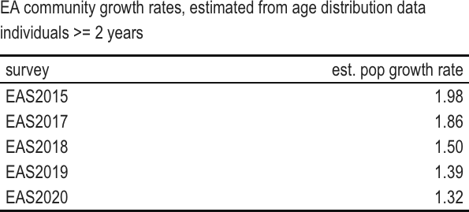
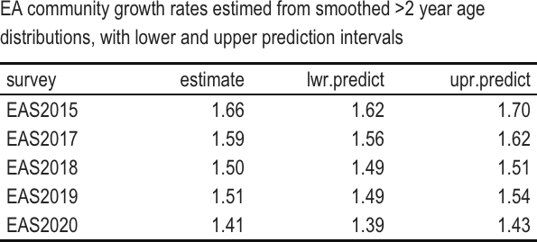

```{r setup, include=FALSE}
knitr::opts_chunk$set(echo = FALSE)
library(rmarkdown)
library(kableExtra)
#install.packages("webshot")
#webshot::install_phantomjs(force=TRUE)
library(magick)
library(webshot)
```

### Estimating changes in the EA community growth rate using survey data

We attempted to use the self-report of "year joined EA" and total response rate in 5 years worth of EA surveys to determine if we can detect changes in the population growth rate of EAs. This approach relies primarily on a static life table interpretation of the data (see definition below), where the number of responses for "year joined EA" is used as a relative index of actual number of of EAs that joined that community in that year. We also attempt simpler approaches where the total number of survey reponses in each year is used as an index of EA community size.


```{r surveyraw, out.width='70%'}
#read in and flip if .xlsx
library(openxlsx)
survey=t(as.data.frame(read.xlsx("EAsurveyjoin.xlsx", rowNames=TRUE)))
psurv=as.data.frame(survey)

#create column of year joined and rearrange
psurv$joined=as.numeric(row.names(survey))
psurv=psurv[,c(6, 1:5)]
#create table of values, save as image and include that image in doc
#basic table
xtab=kable(psurv, row.names=FALSE, format="html", table.attr = "style='width:40%;'",
   caption="Number of EA survey respondents with self-reported year of joining")
#apply some formatting
xtab3=kable_classic(xtab)
#save high quality image (zoom) with white background ("flatly")
save_kable(xtab3, file="surveydata.png", density=600, zoom = 1.5, bs_theme = "flatly")

#put image in doc
knitr::include_graphics("surveydata.png")
```


### Simple community growth rates based on total survey response rates

We begin with analyses of the total number of survey responses as an indicator of EA community size. There are two main approaches: 1. we can assume that fluctutations in the estimated population growth rate from year to year are entirely due to variable survey response rates (observation error), or 2. we can assume that such fluctuations are due to stochastic processes that impact real community size (process error).

#### Analysis assuming observation error only (i.e., variable annual survey response rates)

The first and simplest option is just to use the total number of respones from each survey as an index of current EA population size and obtain community growth rates from any change in these response rates from from year to year. This approach entails the assumptions that each survey proportionately samples the EA community, and that the rate of change in community size is actually constant from year to year, so that all fluctuations in response rate are attributed to observation error (i.e., differences in survey recruitment). There is a weak assumption that a single survey samples all year classes evenly. The assumption of consistent sampling between year classes and surveys could be modified by attaching probabilities for response rates to either. 

We calculate community growth rates by assuming that future community size is a linear function of current community size, where the annual population growth rate, $\lambda=e^r$, can be estimated from the slope of a linear regression of ln community size, $N$ vs. time, $T$ (since ln$(N_t)=$ln$(N_0)+r$ $T$ for exponential growth). This is a common and inutitve method of estimating population growth rates (Caughley 1977); however, if even a small amount of the variance (>10%) actually arises from process error (real differences in community growth rates from year to year), then the confidence intervals will strongly underestimate the actual uncertainty ([Humbert et al. 2009](https://doi.org/10.1111/j.1600-0706.2009.17839.x)).

```{r, fig.caption="Regression to estimate population growth rates (assumes observation error dominates)"}
# create dataframe with total number of respondents per survey year
popsize=colSums(survey, na.rm=TRUE)
popyear=as.numeric(substring(names(popsize), 4, 7))
pop=data.frame(size=popsize, year=popyear)

#regress ln respondents vs year
popreg=lm(log(size)~year, data=pop)
#summary(popreg)
newx = seq(min(pop$year),max(pop$year),by = 0.05)
conf_interval <- predict(popreg, newdata=data.frame(year=newx), interval="confidence", level = 0.95)

plot((popsize)~year,data=pop, log="y", pch=16, ylab="ln survey respondents", xlab="year", ylim=c(600, 3500))


# Backtransform to get confidence intervals
conf_t <- exp(conf_interval)
lines(newx, conf_t[,1], col="red")
lines(newx, conf_t[,2], col="blue", lty=2)
lines(newx, conf_t[,3], col="blue", lty=2)

#
legend("bottom", c("data", "fitted", "CI"), pch=c(16,NA,NA), lty=c(NA,1,2), col=c(1,2,4), bty="n", horiz=TRUE)

```

While the predicted annual population growth rate is $\lambda$=`r round(exp(popreg$coeff[2]),2)`, we can see that there is too much variation for the amount of data here, and that the regression coefficients are not significantly different from zero. 


```{r}
#table of output
regout=c(summary(popreg)$coefficients[2,], summary(popreg)$adj.r.squared)
names(regout)[5]="adj.r.squared"
regco=kable(t(regout), digits=2,format="html", table.attr = "style='width:60%;'",
   caption="Linear regression for natural log of EA survey respondents vs survey year (assumes observation error only)")
save_kable(kable_classic(regco),file="regcoef.png", density=600, zoom = 1.25, bs_theme = "flatly")

```


So either the EA community is not growing, or we cannot detect growth with this approach to the data. It may be that if we had any info regarding survey response rates, this variation might be reduced. However, it is quite likely that there is a reasonable amount of actual variation in recuritment from year to year (a component of process error), so that the variance about this estimate is even larger (see comment above from [Humbert et al. 2009](https://doi.org/10.1111/j.1600-0706.2009.17839.x)). Therefore, on the whole, we cannot recommend this approach, and given the large variance, it probably does not provide any information about the change in the size of the EA community.

#### Analysis assuming process error only (i.e., variable annual community growth rates)
An alternative approach is to assume that only temporal stochastic variation in EA community size, not observation error from variable survey reponse rates, causes the number of reponses to fluctuate from year to year. That is, any fluctuations are real, not observation error. Here community size in the future is determined by previous community size, the average annual growth rate, and an error term (e.g., ln$(N_{t+1})=$ln$(N_t)+\lambda+\epsilon$ where $\epsilon$ ~ Normal(0,$\sigma^2$). That is we describe the change in community size as diffusion plus drift. The simplest method of estimating the population growth rate is then the geometric mean of the calculated annual population growth rate ($\lambda=N_{t+1}/N_{t}$). 

```{r}
#tiny bit of mucking 'cause we have a 2-year interval
Nf=popsize[2]
NF1=popsize[1]
lam1=sqrt(popsize[2]/popsize[1])

#calculate the rest of the growth rates and save
Nt1 = popsize[-(1:2)]
Nt = popsize[2:(length(popsize) - 1)] 
lamt = Nt1/Nt
lam=(c(lam1,lamt))
kx=data.frame(survey=colnames(psurv)[3:6], pgrow=lam)

#get the geo mean
gmlam = exp(mean(log(lam), na.rm=TRUE)) 
gslam = exp(var(log(lam), na.rm=TRUE))

#create table & save as image
tab2=kable(kx, col.names=c("survey", "est. pop growth rate"),row.names=FALSE, format="html", table.attr = "style='width:40%;'",
           digits=2,
   caption="Estimates EA community growth rates from total number of responses (assumes process error only)")
tab3=kable_classic(tab2)
save_kable(tab3, file="tab3.png", density=600, zoom = 1.5, bs_theme = "flatly")
knitr::include_graphics("tab3.png")
```


We get an estimated population growth rate of `r round(gmlam, 2)`, but the variance about the estimate is quite large (standard deviation=`r (round(sqrt(gslam), 2))`), and this growth rate is quite influenced by the 2018 survey. 

Obviously the best approach for this class of methods is to include both observation and process error simultaneously, using a state space approach, for example. But these methods will not be at all robust with fewer than 10 years of data.

### Static life table estimates of EA community growth

We can also use static (or vertical) life table approaches ([Yusuf et al. 2014](https://doi.org/10.1007/978-94-007-6784-3_7)) to estimate attrition rates by age, in order to get population growth rates. To complete these analyses, we will use the self-reported year of joining the EA community. We will generate an indepednent estimate of community growth rates for each survey based on the age structure (i.e., "age" in the EA community) of the respondents. Therefore, in this approach, we need not assume there is similarity in response rates between different surveys. However, to do this analysis we do need to assume that the age distribution is stable from year to year. Therefore, these calculations do rely on the assumption that the actual recruitment, attrition, and survey response rates are the same between years within a given survey report. 

For this method we calculate the community growth rate as $\sum(l_x*m_x)$, where $l_x$ is the retention rate specific to each age class, and $m_x$ is the number of new recruits per current member of the EA community.


```{r attrition, fig.caption="Number of responses by years in the EA community", eval=TRUE,echo=FALSE, fig.width=8}

#reverse order to setup like lifetable
ssurv=survey[order(-as.numeric(row.names(survey))),]


grow=vector()
decr=vector()
statictab=list()

#There is some variation here that leads to survival rates >1
#therefore, if the change in the number of individuals from a younger to older year class
#is positive rather than negative, I will set change to zero 
for (i in 1:ncol(ssurv)){
lt=as.data.frame(ssurv[!is.na(ssurv[,i]),i])
gain=(lt[-nrow(lt),])
chng=gain[-1]-gain[-length(gain)]
chng=c(chng,NA)
chng=ifelse(chng>0, 0, chng)

#calculate retention rates
yr=as.numeric(row.names(lt))
prop=gain/gain[1]
attr=abs(chng)/gain

#calculate age as EA
date=yr[-length(yr)]
years=date[1]-yr[-length(yr)]

#store
df=data.frame(date=date,years=years,num=gain, lx=prop, loss=chng, qx=attr)

#calculate pop growth rate using attrition
dfnew=df$num[1]
mx=dfnew/(sum(df$num[-1]))
Ro=sum(df$lx*mx)
littler=log(Ro)
grow[i]=littler
decr[i]=mean(df$qx, na.rm=TRUE)
statictab[[i]]=df
}

#make table
names(grow)=colnames(ssurv)
ltab=kable((exp(grow)), col.names="pop growth rate", caption="EA community growth rates, estimated from age distribution data", format="html", table.attr = "style='width:40%;'",
           digits=2)

save_kable(kable_classic(ltab), file="ltab.png", density=600, zoom = 1.5, bs_theme = "flatly")
knitr::include_graphics("ltab.png")

```


However, these estimated rates include observations which violate the assumption that recruitment and attrition rates do not vary from year to year.  For some survey years, like 2015, this assumption does not look bad,  but for other years, it seems much less likely. For example, we have a larger number of EAs with age 4 in the community than the number of EAs with age 2 in the 2019 survey. In these cases, where there is negative attrition, we have set the rate to zero. In addition, we should note that we've had to exclude the >2009 year class, because it is always larger than 2010 (a consequence of amalgamating all older years).


```{r}
par(mfrow=c(1,2))
dplo=statictab[[1]]
plot(dplo$years,dplo$num, pch=16, xlab="years as EA", type="b",ylab="# respondents")
legend("topright",colnames(ssurv)[1], pch=16, lty=1, col=1, bty="n" )
dplo=statictab[[1]]
plot(dplo$years,dplo$num, pch=16, xlab="years as EA", type="b",ylab="# respondents",
     xlim=c(0,10), ylim=c(0,800))
for (j in 2:5) {
  dplo=statictab[[j]]
  lines(dplo$years,dplo$num, pch=16,type="b", col=j)
}
legend("topright",colnames(ssurv)[1:5], pch=16, lty=1, col=1:5, bty="n" )
```


Looking at the shape of these curves, we're inclined to be dubious about response rates of EAs less than 2 years old. In particular, the timing of the survey may be important here, since surveys are typically run part way through the year, so we would expect there to be fewer respondents in the current year since some people haven't joined the community yet. In addition, it is plausible that newly recruited community members are less likely to take the EA survey in their first year.

If we exclude these younger year classes, our model of EA community growth will then assume that we don't have a new EA until after the 2 year mark.  We can then calculate survival rates, and use this to get a population growth rate (of 2 year old EAs), as $\sum(l_x*m_x)$, where $l_x$ is survival rate specific to each age class, and $m_x$ is the number of new 2 year old EAs per older community member.


```{r}

grow=vector()
decr=vector()
statictab=list()
#calculate retention rates excluding year classes 1-2
#for each survey
for (i in 1:ncol(ssurv)){
lt=as.data.frame(ssurv[!is.na(ssurv[,i]),i])
lt$yr=as.numeric(row.names(lt))
#remove EAs less than 2
lt=lt[-(1:2),]
#calculate retention
gain=(lt[-nrow(lt),1])
chng=gain[-1]-gain[-length(gain)]
chng=c(chng,NA)
chng=ifelse(chng>0, 0, chng)
prop=gain/gain[1]
attr=abs(chng)/gain
date=lt$yr[-length(lt$yr)]
years=date[1]-lt$yr[-length(lt$yr)]
df=data.frame(date=date,years=years,num=gain, lx=prop, loss=chng, qx=attr)
#calculate growth
dfnew=df$num[1]
mx=dfnew/(sum(df$num[-1]))
Ro=sum(df$lx*mx)
littler=log(Ro)
grow[i]=Ro
decr[i]=mean(df$qx, na.rm=TRUE)
df$surv=lt$surv[1]
statictab[[i]]=df
}
#get the geo mean
a2mph = exp(mean(log(grow), na.rm=TRUE)) 
a2slph = exp(var(log(grow), na.rm=TRUE))
#plot 
dplo=statictab[[1]]
par(mfrow=c(1,2))

#plot(dplo$years+2,dplo$num, pch=16, xlab="years #as EA", type="b",ylab="ln respondents",log="y",
#     xlim=c(0,10), ylim=c(10,1000))
#for (j in 2:5) {
#  dplo=statictab[[j]]
#  lines(dplo$years+2,dplo$num, pch=16,type="b", #col=j)
#}
#plot(dplo$years+2,dplo$lx, pch=16, xlab="years #as EA", type="b",ylab="prob of retention",
#     xlim=c(1,10), ylim=c(0,1.2), col=1)
#for (j in 2:5) {
#  dplo=statictab[[j]]
#  lines(dplo$years+2,dplo$lx, pch=16,type="b", #col=j)
#}
#legend("topright",colnames(ssurv)[1:5], pch=16, #lty=1, col=1:5, bty="n" )


dfage=data.frame(survey=colnames(ssurv)[1:5],popgr=grow)
```

 We have a mean population growth rate of `r round(a2mph,2)` with variance `r round(a2slph,2)`, for a population comprised entirely of those 2 years or older in the community.


```{r}

tab4=kable(dfage,digits=2, col.names=c("survey", "est. pop growth rate"),row.names=FALSE, format="html", table.attr = "style='width:40%;'",
   caption="EA community growth rates, estimated from age distribution data individuals >= 2 years")

save_kable(kable_classic(tab4), file="table2.png",density=600, zoom = 1.5, bs_theme = "flatly")

```


When excluding these younger year classes, there is still some uneveness where attrition rates in a later year is estimated to be greater than that in a prior year. Such uneveness could be attributed to sampling errors. 


```{r}

plot(dplo$years+2,dplo$lx, pch=16, xlab="years as EA", type="b",ylab="probability of remaining in the community",
     xlim=c(1,10), ylim=c(0,1.2))
for (j in 2:5) {
  dplo=statictab[[j]]
  lines(dplo$years+2,dplo$lx, pch=16,type="b", col=j)
}
legend("topright",colnames(ssurv)[1:5], pch=16, lty=1, col=1:5, bty="n" )
```

If we assume that this variation is related to observation error, it makes sense to apply a smoother. Something simple like exponential decay will probably be fine. 

```{r}
egr=data.frame()
staticpred=list()
par(mar=c(7,7,2,2))
 plot(NA, xlab="years as EA", ylab="Number of respondents\n (predicted=lines, acutal=points)", xlim=c(1,12), ylim=c(10,600))
 regstats=data.frame()
 reglist=list()
for (j in 1:5) {
  dplo=statictab[[j]]
  actyrs=dplo$years+2
  regn=lm(log(num)~actyrs, data=dplo)
  reglist[[j]]=regn
 co=summary(regn)$coefficient[2,]
 cr=summary(regn)$adj.r.squared
regstats=rbind(regstats, c(co,cr))
  points((dplo$num)~actyrs, pch=1,col=j)
  yrdat=data.frame(actyrs=c(dplo$years+2, (max(dplo$years)+1)))
  ndat=data.frame(actyrs=yrdat)
  pout=predict(regn, newdata=ndat, interval="prediction")
  
  dplo$predn=exp(pout[,1])[-nrow(pout)]
  lines(dplo$predn~actyrs, type="l", col=j)

 
  Ropred=vector()
for (j in 1:3){
numEAs=exp(pout[,j])
prop=numEAs/numEAs[1]
df=data.frame(years=ndat,num=numEAs, lx=prop)
#calculate growth
dfnew=df$num[1]
mx=dfnew/(sum(df$num[-1]))
Ropred[j]=sum(df$lx*mx)
}
  
egr=rbind(egr, Ropred)
  
  
  
  staticpred[[i]]=dplo
}
 legend("topright",colnames(ssurv)[1:5], pch=16, lty=1, col=1:5, bty="n" )
 
 colnames(regstats)=names(c(co,cr))
 colnames(regstats)[5]="adj R2"
 regstats$survey=colnames(ssurv)
 
 tabreg=kable(regstats,digits=2, 
               #col.names=c("slope", "Std.error", "t value"),
               row.names=FALSE, format="html", table.attr = "style='width:40%;'",
   caption="Fitted coefficients for exponential decline with age of EA community membership")

save_kable(kable_classic( tabreg), file=" tabreg.png",density=600, zoom = 1.5, bs_theme = "flatly")
knitr::include_graphics(" tabreg.png")

```
 
All regressions suggest a significant relationship that explains a reasonable proportion of the variance. The average loss rate is `r round(mean(regstats[,1]),2)`.

We can use these smoothed age distributions to calculate growth rates

```{r}
egryr=cbind(colnames(ssurv), egr)
 tabsmgrow=kable(egryr,digits=2, 
               col.names=c("survey","estimate", "lwr.predict", "upr.predict"),
               row.names=FALSE, format="html", table.attr = "style='width:40%;'",
   caption="EA community growth rates estimed from smoothed >2 year age distributions, with lower and upper prediction intervals")

save_kable(kable_classic( tabsmgrow), file="tabsmgrow.png",density=600, zoom = 1.5, bs_theme = "flatly")


```

In fact, a model examining the effects of survey year suggests that a single smoother would be appropriate for all surveys, with the possible exception of EAS2020.
 
 
```{r}
 library(reshape2)
 lsurv=melt(survey)
 
 lsurv$year=as.numeric(substr(lsurv[,2], 4, 7))
 lsurv$age=lsurv$year-lsurv[,1]
 colnames(lsurv)=c("join", "survey", "n", "year", "age")
 lsurv=lsurv[lsurv$age>1,]
 lsurv=lsurv[lsurv$join>2009,]

 
regall1=lm(log(n)~age*survey, data=lsurv)

 cof=summary(regall1)$coefficient
 
 tabinter=kable(cof,digits=2, 
               #col.names=c("slope", "Std.error", "t value"),
               row.names=TRUE, format="html", table.attr = "style='width:40%;'",
   caption="Interaction between survey and age for estimated exponential decline  of EA community membership")

save_kable(kable_classic(tabinter), file="tabinter.png",density=600, zoom = 1.5, bs_theme = "flatly")
knitr::include_graphics("tabinter.png")
 
 
 
 
 regall=lm(log(n)~age, data=lsurv)
 #confint(regall, 'age', level=0.95)
 
 ndat=data.frame(age=rep(1:10,1))
 pout=predict(regall, newdata=ndat, terms=c("age"),interval="prediction")
 
 plot(exp(pout[-1,1])~(ndat$age[-1]), type="l", xlim=c(1, 12), xlab="age", ylab="number of respondents", ylim=c(0,600))
 points((lsurv$n)~lsurv$age, cex=0.75, col=lsurv$survey)
 lines(exp(pout[-1,2])~(ndat$age[-1]), lty=2)
  lines(exp(pout[-1,3])~(ndat$age[-1]), lty=2)
 legend("topright", c("fitted (decay= -0.35)", levels(lsurv$survey)), lty=c(1, rep(NA,5)),pch=c(NA, rep(1,5)), col=c(1,1:6), bty="n" )
 


```

The overall relationship indicates an loss rate of `r regall$coefficients[2]`. 

```{r}
Ropred=vector()
for (j in 1:3){
numEAs=exp(pout[,j])
prop=numEAs/numEAs[1]

df=data.frame(years=1:10,num=numEAs, lx=prop)
#calculate growth
dfnew=df$num[1]
mx=dfnew/(sum(df$num[-1]))
Ropred[j]=sum(df$lx*mx)
littler=log(Ropred)
}

```

Using this relationship to estimate retention rate suggests that the EA community growth rate (for EAs 2yrs and older) lies between `r round(Ropred[2],2)` and `r round(Ropred[3],2)` which seems very high, and which may reflect better recruitment to the EAsurvey over the years.

Overall, we find weak evidence that the EA community is growing in size, since the majority of estimated annual growth rates from age distribution data were greater than one, while those from survey reponse rates were approximating one or lower. 


## Literature cited

Caughley, G. (1977). Analysis of vertebrate populations. John Wiley & Sons, Inc. New York

Humbert, J.-Y., Scott Mills, L., Horne, J. S., & Dennis, B. (2009). A better way to estimate population trends. _Oikos_, _118_(12), 1940–1946. [https://doi.org/10.1111/j.1600-0706.2009.17839.x](https://doi.org/10.1111/j.1600-0706.2009.17839.x)

Yusuf, F., Martins, J. M., & Swanson, D. A. (2014). Life Tables. In Methods of demographic analysis (pp. 143-172). Springer, Dordrecht.[https://doi.org/10.1007/978-94-007-6784-3_7](https://doi.org/10.1007/978-94-007-6784-3_7)