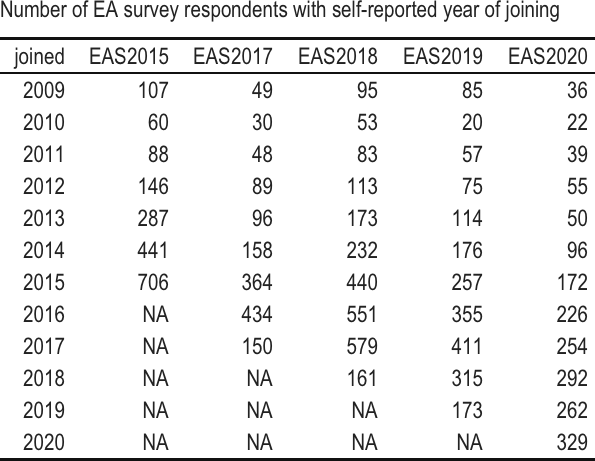
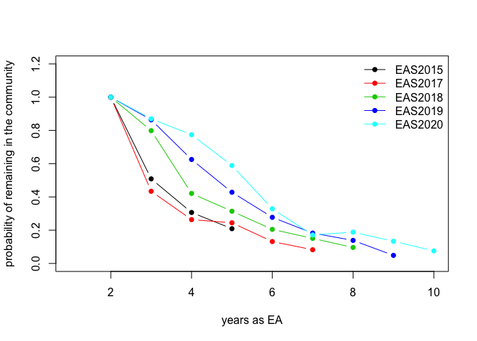

Estimating growth rates of the EA community
================
Kim Cuddington
08/01/2022

### Estimating changes in the EA community growth rate using survey data

We attempted to use the self-report of “year joined EA” and total
response rate in 5 years worth of EA surveys to determine if we can
detect changes in the population growth rate of EAs. This approach
relies primarily on a static life table interpretation of the data (see
definition below), where the number of responses for “year joined EA” is
used as a relative index of actual number of of EAs that joined that
community in that year. We also attempt simpler approaches where the
total number of survey reponses in each year is used as an index of EA
community size.

### Simple community growth rates based on total survey response rates

We begin with analyses of the total number of survey responses as an
indicator of EA community size. There are two main approaches: 1. we can
assume that fluctutations in the estimated population growth rate from
year to year are entirely due to variable survey response rates
(observation error), or 2. we can assume that such fluctuations are due
to stochastic processes that impact real community size (process error).

#### Analysis assuming observation error only (i.e., variable annual survey response rates)

The first and simplest option is just to use the total number of
respones from each survey as an index of current EA population size and
obtain community growth rates from any change in these response rates
from from year to year. This approach entails the assumptions that each
survey proportionately samples the EA community, and that the rate of
change in community size is actually constant from year to year, so that
all fluctuations in response rate are attributed to observation error
(i.e., differences in survey recruitment). There is a weak assumption
that a single survey samples all year classes evenly. The assumption of
consistent sampling between year classes and surveys could be modified
by attaching probabilities for response rates to either.

We calculate community growth rates by assuming that future community
size is a linear function of current community size, where the annual
population growth rate, *λ* = *e**r*, can be estimated from
the slope of a linear regression of ln community size, *N* vs. time, *T*
(since ln(*N**t*)=ln(*N*0) + *r* *T* for
exponential growth). This is a common and inutitve method of estimating
population growth rates (Caughley 1977); however, if even a small amount
of the variance (>10%) actually arises from process error (real
differences in community growth rates from year to year), then the
confidence intervals will strongly underestimate the actual uncertainty
([Humbert et
al. 2009](https://doi.org/10.1111/j.1600-0706.2009.17839.x)).

<!-- -->

While the predicted annual population growth rate is *λ*=1.03, we can
see that there is too much variation for the amount of data here, and
that the regression coefficients are not significantly different from
zero.

So either the EA community is not growing, or we cannot detect growth
with this approach to the data. It may be that if we had any info
regarding survey response rates, this variation might be reduced.
However, it is quite likely that there is a reasonable amount of actual
variation in recuritment from year to year (a component of process
error), so that the variance about this estimate is even larger (see
comment above from [Humbert et
al. 2009](https://doi.org/10.1111/j.1600-0706.2009.17839.x)). Therefore,
on the whole, we cannot recommend this approach, and given the large
variance, it probably does not provide any information about the change
in the size of the EA community.

#### Analysis assuming process error only (i.e., variable annual community growth rates)

An alternative approach is to assume that only temporal stochastic
variation in EA community size, not observation error from variable
survey reponse rates, causes the number of reponses to fluctuate from
year to year. That is, any fluctuations are real, not observation error.
Here community size in the future is determined by previous community
size, the average annual growth rate, and an error term (e.g.,
ln(*N**t* + 1)=ln(*N**t*) + *λ* + *ϵ* where *ϵ* \~
Normal(0,*σ*2). That is we describe the change in community
size as diffusion plus drift. The simplest method of estimating the
population growth rate is then the geometric mean of the calculated
annual population growth rate
(*λ* = *N**t* + 1/*N**t*).

We get an estimated population growth rate of 1.03, but the variance
about the estimate is quite large (standard deviation=1.06), and this
growth rate is quite influenced by the 2018 survey.

Obviously the best approach for this class of methods is to include both
observation and process error simultaneously, using a state space
approach, for example. But these methods will not be at all robust with
fewer than 10 years of data.

### Static life table estimates of EA community growth

We can also use static (or vertical) life table approaches ([Yusuf et
al. 2014](https://doi.org/10.1007/978-94-007-6784-3_7)) to estimate
attrition rates by age, in order to get population growth rates. To
complete these analyses, we will use the self-reported year of joining
the EA community. We will generate an indepednent estimate of community
growth rates for each survey based on the age structure (i.e., “age” in
the EA community) of the responents. Therefore, in this approach, we
need not assume there is similarity in response rates between different
surveys. However, to do this analysis we do need to assume that the age
distribution is stable from year to year. Therefore, these calculations
do rely on the assumption that the actual recruitment, attrition, and
survey response rates are the same between years within a given survey
report.

For this method we calculate the community growth rate as
∑(*l**x*\**m**x*), where *l**x* is the
retention rate specific to each age class, and *m**x* is the
number of new recruits per current member of the EA community.

However, these estimated rates include observations which violate the
assumption that recruitment and attrition rates do not vary from year to
year. For some survey years, like 2015, this assumption does not look
bad, but for other years, it seems much less likely. For example, we
have a larger number of EAs with age 4 in the community than the number
of EAs with age 2 in the 2019 survey. In these cases, where there is
negative attrition, we have set the rate to zero. In addition, we should
note that we’ve had to exclude the \>2009 year class, because it is
always larger than 2010 (a consequence of amalgamating all older years).

<!-- -->

Looking at the shape of these curves, we’re inclined to be dubious about
response rates of EAs less than 2 years old. In particular, the timing
of the survey may be important here, since surveys are typically run
part way through the year, so we would expect there to be fewer
respondents in the current year since some people haven’t joined the
community yet. In addition, it is plausible that newly recruited
community members are less likely to take the EA survey in their first
year.

If we exclude these younger year classes, our model of EA community
growth will then assume that we don’t have a new EA until after the 2
year mark. We can then calculate survival rates, and use this to get a
population growth rate (of 2 year old EAs), as
∑(*l**x*\**m**x*), where *l**x* is
survival rate specific to each age class, and *m**x* is the
number of new 2 year old EAs per older community member.

We have a mean population growth rate of 1.59 with variance 1.03, for a
population comprised entirely of those 2 years or older in the
community.

When excluding these younger year classes, there is still some uneveness
where attrition rates in a later year is estimated to be greater than
that in a prior year. Such uneveness could be attributed to sampling
errors.

<!-- -->

If we assume that this variation is related to observation error, it
makes sense to apply a smoother. Something simple like exponential decay
will probably be fine.

<!-- -->

All regressions suggest a significant relationship that explains a
reasonable proportion of the variance. The average loss rate is -0.42.

We can use these smoothed age distributions to calculate growth rates

In fact, a model examining the effects of survey year suggests that a
single smoother would be appropriate for all surveys, with the possible
exception of EAS2020.

<!-- -->

The overall relationship indicates an loss rate of -0.3468.

Using this relationship to estimate retention rate suggests that the EA
community growth rate (for EAs 2yrs and older) lies between 1.42 and
1.44 which seems very high, and which may reflect better recruitment to
the EAsurvey over the years.

Overall, we find weak evidence that the EA community is growing in size,
since the majority of estimated annual growth rates from age
distribution data were greater than one, while those from survey reponse
rates were approximating one or lower.

## Literature cited

Caughley, G. (1977). Analysis of vertebrate populations. John Wiley &
Sons, Inc. New York

Humbert, J.-Y., Scott Mills, L., Horne, J. S., & Dennis, B. (2009). A
better way to estimate population trends. *Oikos*, *118*(12), 1940–1946.
<https://doi.org/10.1111/j.1600-0706.2009.17839.x>

Yusuf, F., Martins, J. M., & Swanson, D. A. (2014). Life Tables. In
Methods of demographic analysis (pp. 143-172). Springer,
Dordrecht.<https://doi.org/10.1007/978-94-007-6784-3_7>
